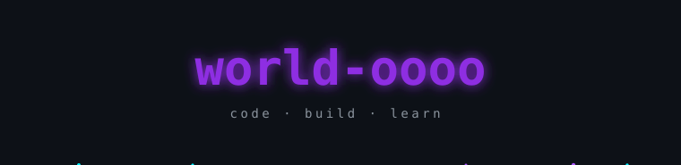
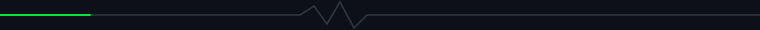

여러 분야를 기웃거리며 배우는 중입니다. 
만들면서 배우고, 배우면서 또 만듭니다.

<!--
  📊 통계 위젯 — 공개 저장소가 생기면 이 주석의 첫 줄과 마지막 줄만 지우세요.

  주의: github-readme-stats 공용 인스턴스는 GitHub API 시간당 한도를 전체
  사용자와 공유해서, 과부하 시 카드 대신 에러 이미지가 뜹니다 (2026-08-18
  확인 당시 503). 계속 실패하면 본인 Vercel 계정에 직접 배포하고 PAT_1
  환경변수를 등록하세요: https://github.com/anuraghazra/github-readme-stats

  트로피(github-profile-trophy)는 넣지 않았습니다 — 2026-08-18 기준 402
  Payment Required로 무료 인스턴스가 중단된 상태입니다.

-->

