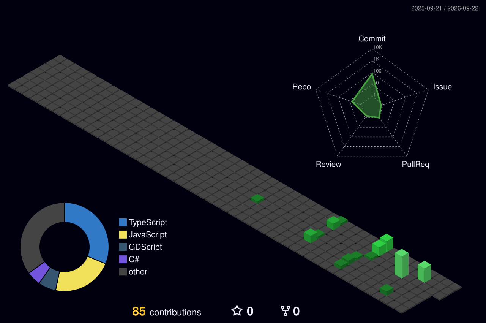

여러 분야를 기웃거리며 배우는 중입니다. 
만들면서 배우고, 배우면서 또 만듭니다.

<!--
  📊 통계 위젯 안내

  지금은 공개 저장소가 0개라 통계 카드가 전부 0으로 표시되므로 꺼두었습니다.
  저장소가 생기면 아래 STATS-BLOCK 주석의 여는 줄과 닫는 줄, 딱 두 줄만
  지우면 활성화됩니다. 이 안내 주석은 지우지 말고 그대로 두세요.

  주의: github-readme-stats 공용 인스턴스는 GitHub API 시간당 한도를 전체
  사용자와 공유해서, 과부하 시 카드 대신 에러 이미지가 뜹니다 (2026-08-18
  확인 당시 503). 계속 실패하면 본인 Vercel 계정에 직접 배포하고 PAT_1
  환경변수를 등록하세요: https://github.com/anuraghazra/github-readme-stats

  트로피(github-profile-trophy)는 넣지 않았습니다 — 2026-08-18 기준 402
  Payment Required로 무료 인스턴스가 중단된 상태입니다.
-->

<!-- STATS-BLOCK — 이 줄과 맨 아래 닫는 줄을 지우면 통계 위젯이 켜집니다

-->

